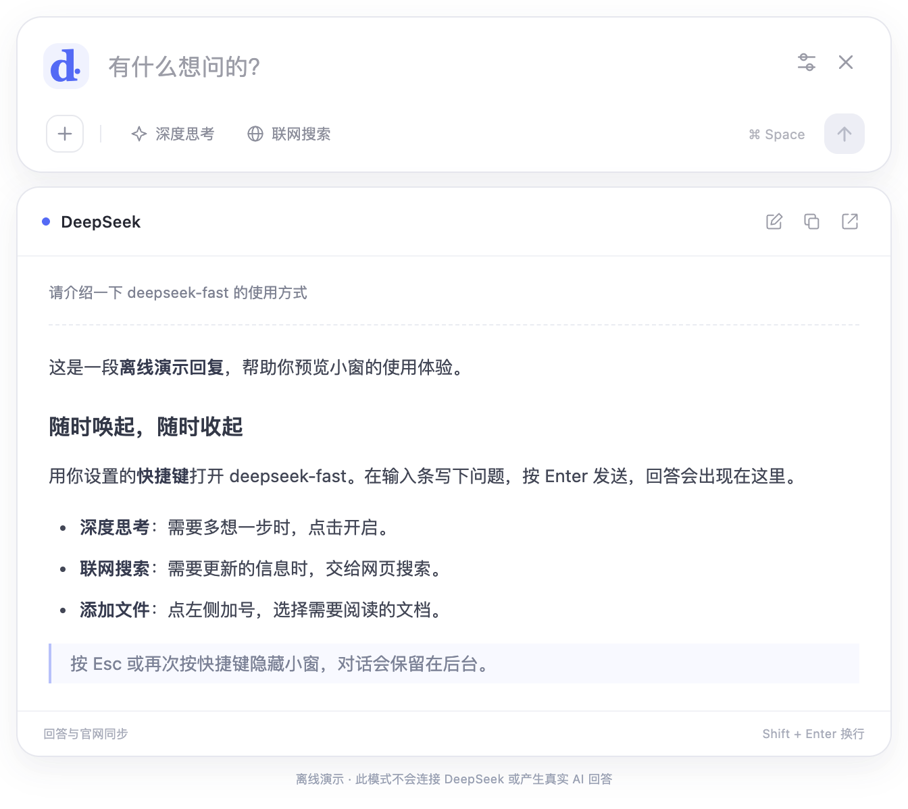
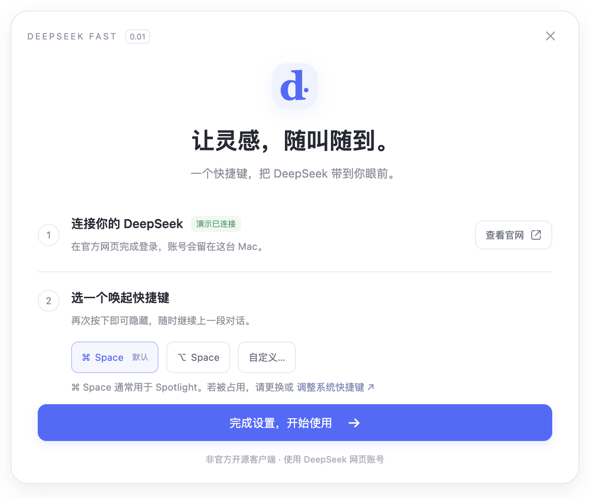

# deepseek-fast

**按一下，DeepSeek 就在眼前。**

[](https://github.com/Wfssll/deepseek-fast/releases/tag/v0.01)
[](https://github.com/Wfssll/deepseek-fast/releases)
[](LICENSE)

`deepseek-fast` 将 DeepSeek 官方网页版变成一个可以用全局快捷键唤起的 macOS 小窗。写作、读文档、写代码时，按一下快捷键，在窄输入条里提问；回答在下方展开，再按一下就收起，继续手头的工作。

使用你的 DeepSeek 网页账号，支持深度思考、联网搜索与文件上传入口，**无需 API Key**。

**A keyboard-first macOS mini window for DeepSeek.** Toggle it from anywhere, ask in a compact composer, and read replies in an expandable card. Uses your official web account with DeepThink, web search, and file attachments. No API key required.


<details>
<summary>查看回答卡片与首次设置</summary>





截图来自独立离线演示；示例回复用于展示界面，不是真实 AI 回答。

</details>

## 为什么做这个小窗

一个问题不应该打断整段工作。`deepseek-fast` 把常用的提问入口留在快捷键后面：不必寻找浏览器标签页，也不必始终占用一整块屏幕。需要完整的会话、登录或网页功能时，可以随时打开程序内的官方网页窗口。

## 已有功能

| 功能 | 使用方式 |
| --- | --- |
| 全局唤起 / 隐藏 | 默认 `Command + Space`；可自定义组合 |
| 窄输入条 | 平时只显示输入区和常用按钮，收到回复后展开回答卡片 |
| 深度思考 | 在输入条直接切换，状态与官网同步 |
| 联网搜索 | 对应当前官网的「智能搜索」选项 |
| 添加文件 | 点击加号，选择文件交给官网上传和解析 |
| 官网回复同步 | 持续同步网页已渲染的回答，支持复制与完整官网查看 |
| 菜单栏常驻 | 关闭窗口即隐藏；快捷键或菜单栏均可找回 |
| 本地登录会话 | 首次在官网窗口登录，后续复用本机保存的会话 |
| 登录 Mac 时启动 | 可在设置中开启，默认关闭 |

## 下载与使用

从 **[GitHub Releases 下载 0.01](https://github.com/Wfssll/deepseek-fast/releases/tag/v0.01)**。

首版提供 **Apple Silicon（M 系列 Mac）** 的应用包。Intel Mac 暂未提供预构建下载，可在对应机器上从源码构建。

1. 解压下载包，将 `deepseek-fast.app` 拖入「应用程序」文件夹，打开应用。
2. 首次启动点击「打开官网」，在程序自己的 DeepSeek 官方网页登录账号。
3. 返回设置窗口，选择唤起快捷键，点击「完成设置」。
4. 按快捷键打开输入条，输入问题并按 `Enter`；使用 `Shift + Enter` 换行。
5. 按同一个快捷键或 `Esc` 收起小窗，对话继续留在后台。

**快捷键冲突：** `Command + Space` 通常用于 Spotlight。程序会检查快捷键注册是否成功；如果已被占用，可使用设置中的系统快捷键入口调整 Spotlight，或选择 `Option + Space` / 自定义组合。程序不会自动改动系统快捷键。

**退出应用：** 点击菜单栏图标，选择「退出 deepseek-fast」。关闭小窗本身只会隐藏。

**分发状态：** 0.01 是早期公开版本，下载包尚未经过 Apple Developer 签名和公证。遇到 macOS 的开发者身份提示时，请确认下载来源为本仓库；也可以使用下面的源码运行方式。

## 从源码运行

需要 macOS、**Node.js 22.12 或更新版本**，以及能连接 npm、Electron 下载源和 DeepSeek 的网络。

```bash
git clone https://github.com/Wfssll/deepseek-fast.git
cd deepseek-fast
npm ci
npm start
```

若你的 npm 配置禁止安装脚本，导致 Electron 可执行文件未下载，请执行：

```bash
node node_modules/electron/install.js
```

不登录账号，只预览界面：

```bash
npm run demo
```

演示模式加载独立的本地测试网页，使用固定回复，**不会连接 DeepSeek，不会生成真实 AI 回答**，也不使用正常模式的账号会话。

## 构建与验证

```bash
npm run check          # JavaScript 语法检查
npm test               # 自动化检查
npm run smoke          # 启动真实桌面窗口，测试离线交互
npm run build          # 构建当前 Mac 架构的 .app
npm run release:zip    # 生成下载 ZIP 和 SHA-256 校验文件
```

应用输出至 `dist/deepseek-fast-darwin-<架构>/deepseek-fast.app`。界面截图和桌面测试结果输出至 `test-output/`。

对外版本号为 **0.01**，对应 Git 标签 `v0.01`；内部 npm/macOS 版本使用等价的语义版本 `0.0.1`。

## 工作方式与隐私

应用在隔离的浏览器窗口中加载 `https://chat.deepseek.com/`。小窗操作官网自身的输入框和按钮，再同步网页上已经渲染的回复；**不需要 API Key，不调用 DeepSeek 私有接口，不提供独立 AI 服务**。

- 登录由 DeepSeek 官方网页处理，会话保存在本机的应用数据目录。
- 官网窗口没有 Node.js 权限，也没有小窗的本地操作桥；同步的回答 HTML 使用 DOMPurify 清理。
- 选择上传文件后，文件交由 DeepSeek 官方网页处理，适用 DeepSeek 的服务和隐私规则。
- 项目不会将登录会话、文件或聊天记录上传到 GitHub。
- 开发模式数据存放于 `.runtime/profile/`。打包应用沿用 `~/Library/Application Support/DeepSeek Mini/`，保证早期原型升级后仍可保留账号与设置；该历史目录名不影响应用名称。
- 本地会话是浏览器数据，不承诺额外加密。发布源码时请始终排除运行数据目录。

## 当前边界

首版已通过 12 项自动化检查与桌面交互测试，正式应用的官网登录、提问、真实回复同步和搜索状态也已在本机验证。

文件上传和解析、长时间后台运行、不同 macOS 版本及 Intel Mac 仍需要更多使用反馈。网页功能和使用额度由你的 DeepSeek 账号决定；官网改版可能需要更新适配器。登录过期、安全验证或访问受限时，请打开完整官网窗口处理。

## 项目结构

```text
src/main.js          窗口、菜单栏、快捷键、会话及可信 IPC
src/adapter.js       DeepSeek 网页 DOM 适配器
src/core.js          设置存取、快捷键与官方地址检查
src/preload.js       小窗的最小权限桥
src/ui/              窄输入条、回答卡片、首次设置
scripts/             语法检查、图标、macOS 打包与发布归档
test/                自动化测试与离线演示网页
```

## 反馈与贡献

欢迎通过 **[Issues](https://github.com/Wfssll/deepseek-fast/issues)** 提交问题与想法，或通过 Pull Request 参与改进。反馈问题时，请说明 macOS 版本、机器架构、复现步骤与预期行为；截图前请隐藏账号和私人聊天内容。

## 许可证与声明

[MIT License](LICENSE)。这是独立的非官方开源项目，与 DeepSeek 无隶属或背书关系。DeepSeek 名称属于其权利持有人；请遵守官方服务的使用规则。
